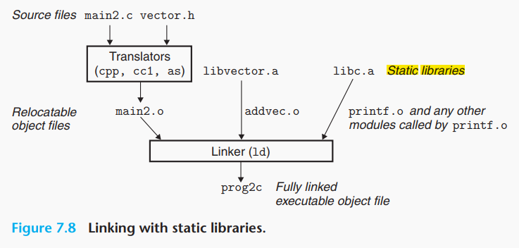
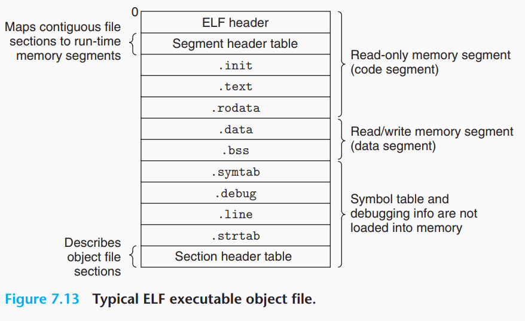
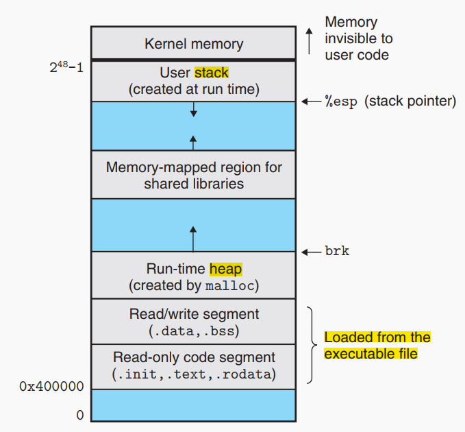
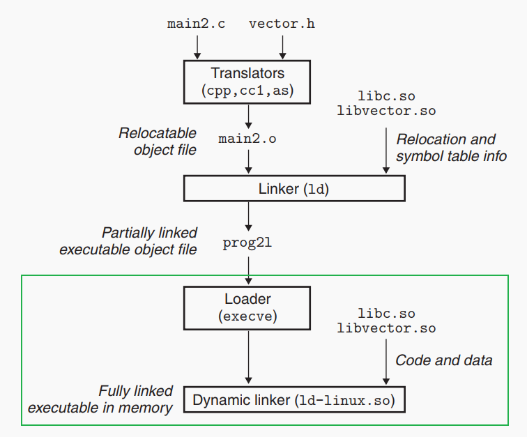
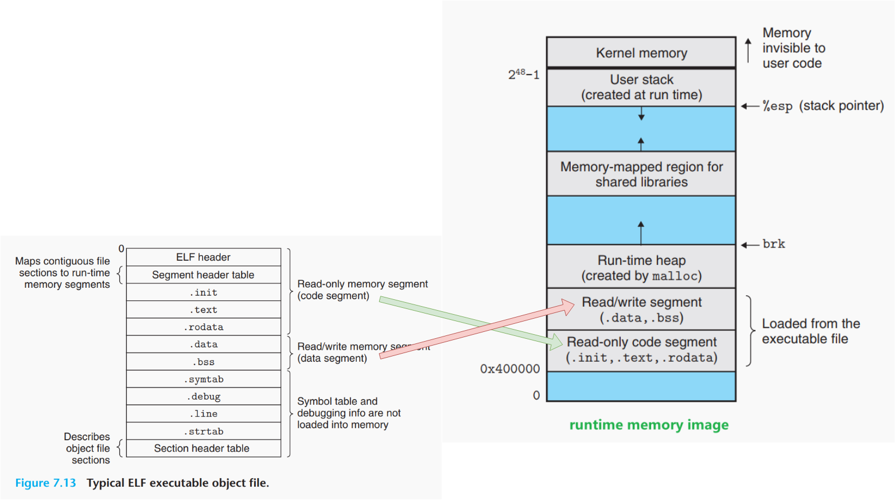

# compile time VS runtime VS load time

## compile time

`source code` + `static library` ==> `executable file`

### files relationship

### sections in executable file

## runtime 

**progress start to run**

### progress image

## load time

load executable file to `memory`, setup progress.

## put it all together

`compile time` ==> `load time` ==> `runtime`

## see also

CSAPP chapter 7
